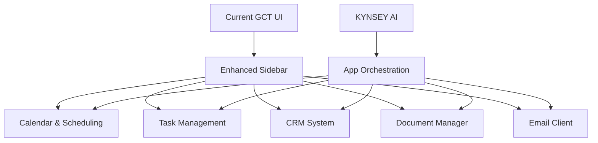
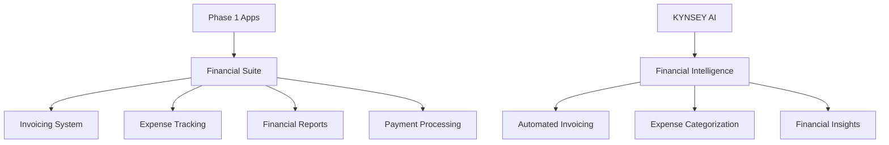
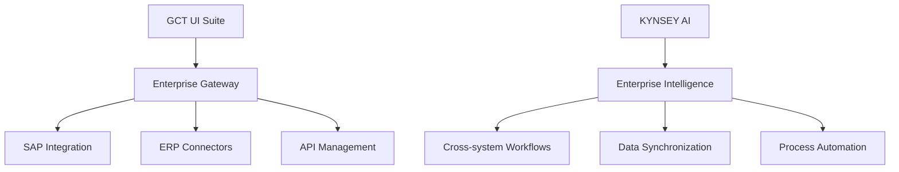
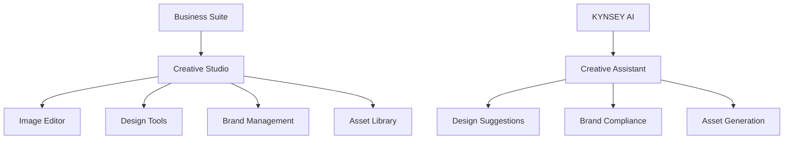
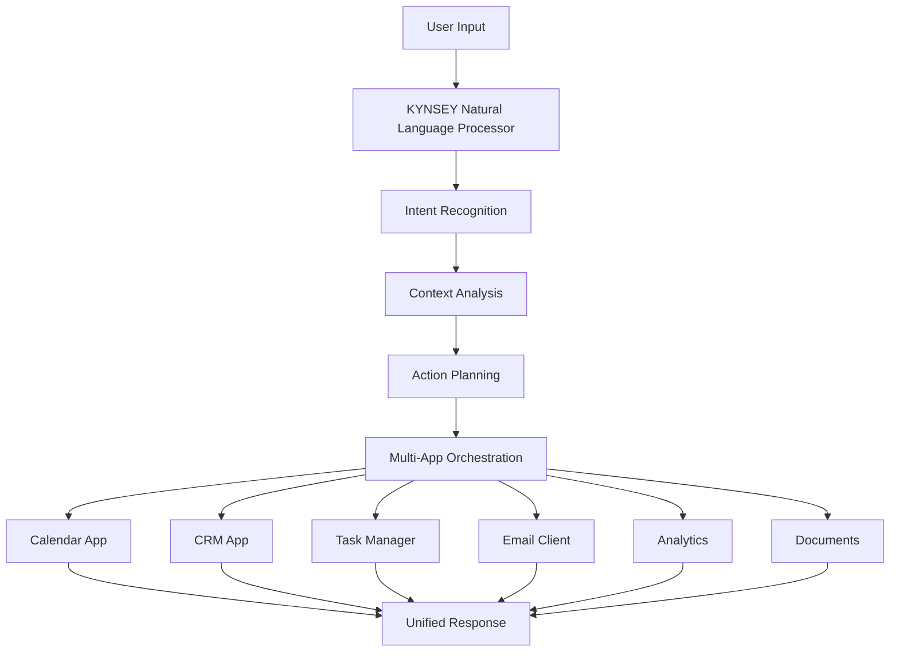
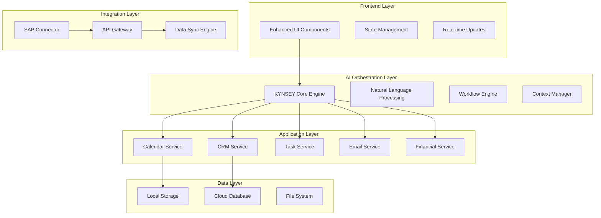
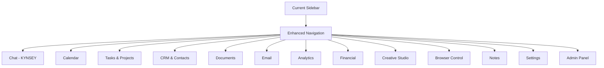
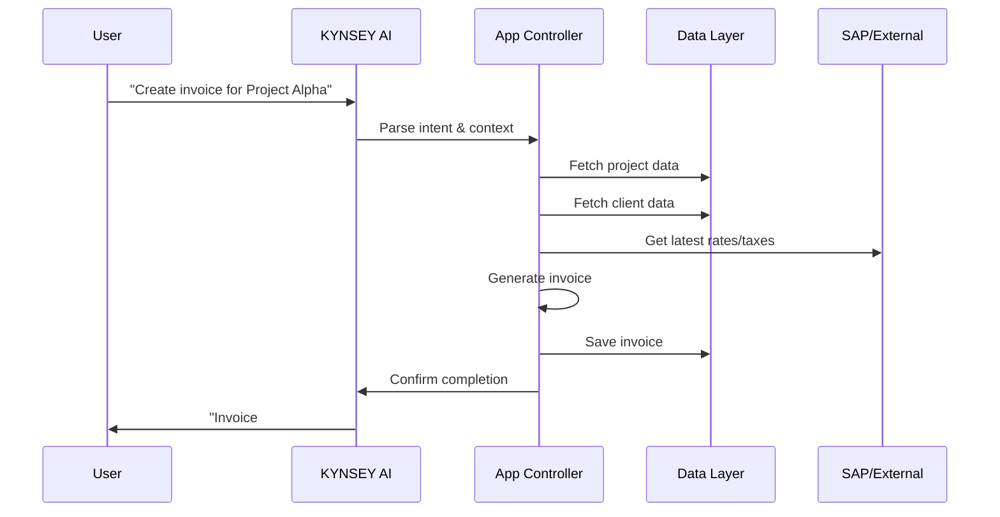

# GCT UI Enhancement Plan: Complete Business Suite with AI Orchestration

## Executive Summary

Transform the existing GCT UI from a chat interface with basic tools into a comprehensive business suite that rivals enterprise platforms like Microsoft 365, SAP, and Salesforce, while maintaining the unique AI-first approach with KYNSEY as the central orchestrator.

## Current State Analysis

Based on my review of the codebase, the GCT UI already has a solid foundation:

### ✅ Existing Features
- **Core Chat Interface** with KYNSEY AI assistant
- **Notes Application** with WYSIWYG editor and AI enhancement
- **Analytics Suite** with data visualization and AI insights
- **Browser Control** with Puppeteer integration
- **Admin Panel** with user management
- **Settings Management** with themes and preferences

### 🔧 Technical Infrastructure
- Modular architecture with separate components
- Configuration management system
- API integration framework
- Real-time UI updates
- Responsive design foundation

## Enhancement Strategy

### Phase 1: Core Business Applications (Priority 1)
**Timeline: 2-3 months**

#### 1.1 Calendar & Scheduling System
- **Features**: 
  - Multi-view calendar (day/week/month/year)
  - Meeting scheduling with availability checking
  - Recurring events and reminders
  - Integration with email invitations
  - Time zone support
- **AI Integration**: 
  - "Schedule a meeting with John next Tuesday"
  - Smart conflict resolution
  - Automatic meeting preparation

#### 1.2 Task Management & Project Tracking
- **Features**:
  - Kanban boards and list views
  - Project hierarchies and dependencies
  - Time tracking and reporting
  - Team collaboration and assignments
  - Milestone tracking
- **AI Integration**:
  - "Create a project plan for website redesign"
  - Automatic task prioritization
  - Progress predictions

#### 1.3 Customer Relationship Management (CRM)
- **Features**:
  - Contact management with detailed profiles
  - Lead tracking and pipeline management
  - Communication history
  - Sales forecasting
  - Custom fields and tags
- **AI Integration**:
  - "Show me all leads from last month"
  - Automated follow-up suggestions
  - Lead scoring

#### 1.4 Document Management System
- **Features**:
  - File organization with folders and tags
  - Version control and collaboration
  - Document templates
  - Search and filtering
  - Access permissions
- **AI Integration**:
  - "Find all contracts from Q2"
  - Document summarization
  - Template suggestions

#### 1.5 Integrated Email Client
- **Features**:
  - Multiple account support
  - Conversation threading
  - Email templates and signatures
  - Calendar integration
  - Contact synchronization
- **AI Integration**:
  - "Draft a follow-up email to Sarah"
  - Smart categorization
  - Response suggestions

### Phase 2: Financial & Business Operations (Priority 2)
**Timeline: 1-2 months**

#### 2.1 Invoicing & Billing System
- **Features**:
  - Professional invoice templates
  - Recurring billing automation
  - Payment tracking and reminders
  - Multi-currency support
  - Tax calculations
- **AI Integration**:
  - "Generate invoice for Project Alpha"
  - Payment prediction analytics
  - Automated follow-ups

#### 2.2 Expense Management
- **Features**:
  - Receipt scanning and categorization
  - Expense reporting and approval workflows
  - Budget tracking and alerts
  - Mileage tracking
  - Integration with accounting systems
- **AI Integration**:
  - "Categorize this receipt"
  - Budget optimization suggestions
  - Expense pattern analysis

#### 2.3 Financial Dashboard & Reporting
- **Features**:
  - Real-time financial metrics
  - Profit & loss statements
  - Cash flow projections
  - Custom report builder
  - Export capabilities
- **AI Integration**:
  - "Show me this quarter's performance"
  - Predictive financial modeling
  - Anomaly detection

### Phase 3: Enterprise Integration & SAP Connectivity (Priority 3)
**Timeline: 2-3 months**

#### 3.1 SAP Integration Framework
- **Features**:
  - SAP RFC/REST API connectivity
  - Real-time data synchronization
  - Master data management
  - Workflow integration
  - Security and authentication
- **AI Integration**:
  - "Pull latest sales data from SAP"
  - Cross-system process automation
  - Data quality monitoring

#### 3.2 Enterprise Data Hub
- **Features**:
  - Unified data model across systems
  - Real-time data streaming
  - Data transformation and mapping
  - Audit trails and compliance
  - Performance monitoring
- **AI Integration**:
  - "Analyze customer data across all systems"
  - Automated data reconciliation
  - Predictive maintenance

### Phase 4: Creative & Design Tools (Priority 4)
**Timeline: 2-3 months**

#### 4.1 Integrated Image Editor
- **Features**:
  - Canvas-based editing with layers
  - Filters, effects, and adjustments
  - Text and shape tools
  - Export in multiple formats
  - Collaboration features
- **AI Integration**:
  - "Remove background from this image"
  - Automatic image enhancement
  - Style transfer and generation

#### 4.2 Design & Layout Tools
- **Features**:
  - Template library for presentations, flyers, social media
  - Drag-and-drop interface
  - Brand kit integration
  - Vector graphics support
  - Animation capabilities
- **AI Integration**:
  - "Create a presentation about Q3 results"
  - Automatic layout optimization
  - Content suggestions

## KYNSEY AI Orchestration Architecture

### Central Command System

### AI Capabilities Framework

#### 1. Cross-Application Workflows
- **Example**: "Schedule a client meeting, create a project for them, and send a welcome email"
- **Process**: Calendar → CRM → Task Manager → Email Client
- **AI Role**: Orchestrates the entire workflow, maintains context

#### 2. Intelligent Data Synthesis
- **Example**: "Generate a quarterly business review"
- **Process**: Analytics → CRM → Financial → Document Generator
- **AI Role**: Pulls data from multiple sources, creates comprehensive reports

#### 3. Predictive Assistance
- **Example**: "What should I focus on this week?"
- **Process**: Calendar + Tasks + CRM + Analytics analysis
- **AI Role**: Provides prioritized recommendations based on business goals

## Technical Implementation Plan

### Architecture Overview

### Enhanced Sidebar Navigation

### Data Flow Architecture

## User Experience Enhancements

### 1. Unified Command Interface
- **Global Search**: Find anything across all applications
- **Command Palette**: Quick actions with natural language
- **Voice Control**: "KYNSEY, show me today's schedule"
- **Smart Suggestions**: Context-aware recommendations

### 2. Seamless App Switching
- **Tabbed Interface**: Multiple apps open simultaneously
- **Quick Switcher**: Keyboard shortcuts for rapid navigation
- **Context Preservation**: Maintain state when switching apps
- **Cross-App References**: Link tasks to calendar events, emails to CRM contacts

### 3. Intelligent Notifications
- **Priority-Based**: AI determines importance
- **Contextual**: Show relevant information
- **Actionable**: Direct actions from notifications
- **Unified Center**: All notifications in one place

## Implementation Roadmap

### Month 1-2: Foundation Enhancement
- [ ] Enhanced sidebar with new app placeholders
- [ ] Improved state management system
- [ ] KYNSEY orchestration framework
- [ ] Calendar application development

### Month 3-4: Core Business Apps
- [ ] Task management system
- [ ] CRM implementation
- [ ] Document manager
- [ ] Email client integration

### Month 5-6: Financial Suite
- [ ] Invoicing system
- [ ] Expense tracking
- [ ] Financial reporting
- [ ] Payment processing integration

### Month 7-9: Enterprise Integration
- [ ] SAP connectivity framework
- [ ] Enterprise data hub
- [ ] Advanced workflow automation
- [ ] Security and compliance features

### Month 10-12: Creative Tools & Polish
- [ ] Image editor implementation
- [ ] Design tools development
- [ ] Performance optimization
- [ ] Mobile responsiveness
- [ ] Advanced AI features

## Success Metrics

### User Engagement
- **Daily Active Users**: Target 80% increase
- **Session Duration**: Target 150% increase
- **Feature Adoption**: 70% of users using 3+ apps
- **AI Interaction**: 60% of actions through KYNSEY

### Business Value
- **Productivity Gains**: 40% reduction in task completion time
- **Cost Savings**: 30% reduction in software licensing costs
- **User Satisfaction**: 90%+ satisfaction rating
- **Enterprise Adoption**: 50+ enterprise clients

## Risk Mitigation

### Technical Risks
- **Performance**: Implement lazy loading and optimization
- **Complexity**: Maintain modular architecture
- **Integration**: Robust error handling and fallbacks
- **Security**: Enterprise-grade security measures

### Business Risks
- **User Adoption**: Gradual rollout with training
- **Competition**: Focus on AI differentiation
- **Scalability**: Cloud-native architecture
- **Support**: Comprehensive documentation and help system

## Next Steps

1. **Approve this enhancement plan**
2. **Set up development environment and team structure**
3. **Begin Phase 1 implementation with calendar system**
4. **Establish CI/CD pipeline for continuous deployment**
5. **Create detailed technical specifications for each component**

---

*This comprehensive plan transforms GCT UI into a powerful, AI-orchestrated business suite that can compete with enterprise solutions while maintaining its unique conversational interface and intelligent automation capabilities.*

**Created**: 2025-05-27  
**Version**: 1.0  
**Status**: Ready for Implementation